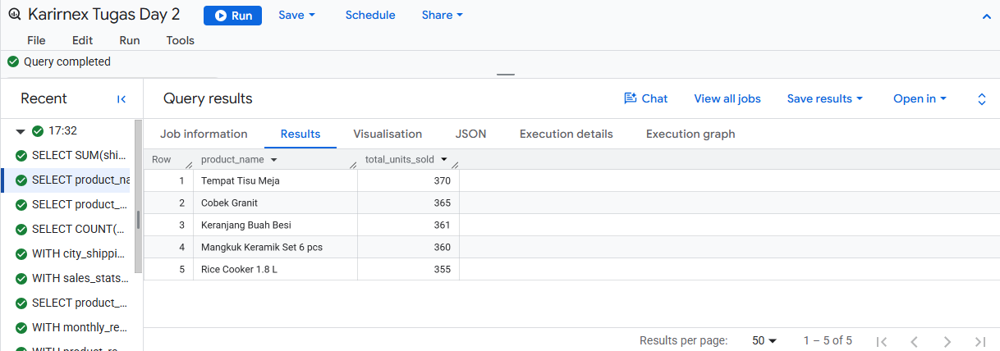
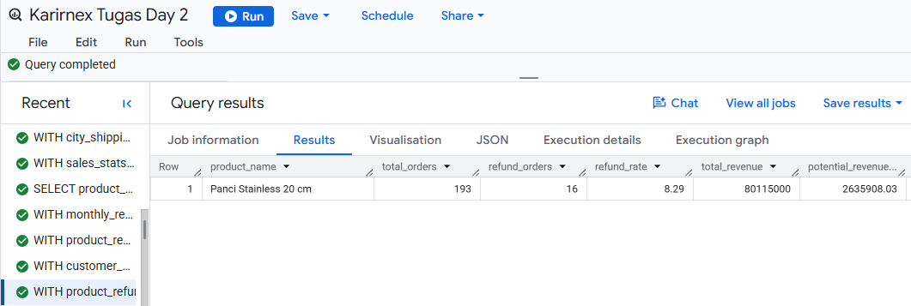

#  Sales Performance Analysis Using SQL (Google BigQuery)

##  Project Overview

This project analyzes sales transaction data using **Google BigQuery SQL** to answer ten business questions related to sales performance. The analysis explores sales trends, shipping costs, refund rates, customer purchasing behavior, and revenue contribution to generate actionable business insights.

---

##  Objectives

- Analyze total and average shipping costs.
- Identify top-selling products by quantity and revenue.
- Evaluate sales performance during Q4 2025.
- Compare shipping costs across cities.
- Measure refund value and refund percentage.
- Identify products with the highest average quantity per order.
- Analyze monthly revenue performance by product category.
- Apply Pareto (80/20) analysis to product revenue.
- Analyze customer purchase frequency.
- Calculate potential revenue improvement by reducing refund rates.

---

##  Tools & Technologies

- Google BigQuery
- SQL (Standard SQL)
- Google Cloud Platform (GCP)

---

##  SQL Skills Demonstrated

- SELECT
- WHERE
- GROUP BY
- ORDER BY
- HAVING
- Aggregate Functions (SUM, AVG, COUNT)
- COUNTIF()
- CASE WHEN
- Common Table Expressions (CTE)
- Window Functions
- ROW_NUMBER()
- LAG()
- DATE_DIFF()
- SAFE_DIVIDE()
- ROUND()
- FORMAT_DATE()

---

##  Business Questions

| No | Business Question |
|----|-------------------|
| 1 | Calculate total and average shipping costs in 2025. |
| 2 | Identify the top 5 products by units sold and compare them with the top 5 products by revenue. |
| 3 | Calculate completed orders and revenue during Q4 2025. |
| 4 | Compare the highest and lowest average shipping costs across cities. |
| 5 | Measure refund value and refund percentage against gross sales. |
| 6 | Find the top 5 products with the highest average quantity per completed order. |
| 7 | Identify the highest monthly revenue for each product category. |
| 8 | Determine how many products contribute to approximately 80% of total revenue (Pareto Analysis). |
| 9 | Find the customer with the shortest average interval between purchases. |
| 10 | Identify the product with the highest refund rate and estimate potential revenue savings. |

---

##  Key Findings

- Total shipping cost in **2025** reached **Rp570,160,000** with an average shipping cost of **Rp57,016** per order.
- The **Top 5 Best-Selling Products** are different from the **Top 5 Revenue-Generating Products**, indicating that high sales volume does not always produce the highest revenue.
- During **Q4 2025**, the company recorded **2,156 completed orders** generating **Rp1,172,346,400** in revenue.
- Average shipping costs ranged from **Rp50,000** to **Rp60,000**, with a difference of **Rp10,000**.
- Total refund value reached **Rp250,641,700**, representing **4.73%** of total gross sales.
- **22 products** contributed approximately **80%** of total completed revenue, illustrating the Pareto Principle.
- **Customer_3** showed the highest purchase frequency with an average interval of **9.93 days** between purchases.
- **Panci Stainless 20 cm** had the highest refund rate (**8.29%**) with a potential revenue recovery of approximately **Rp2.64 million** if the refund rate were reduced to 5%.

## 📷 Query Results

### Top 5 Products by Units Sold

### Refund Rate Analysis

